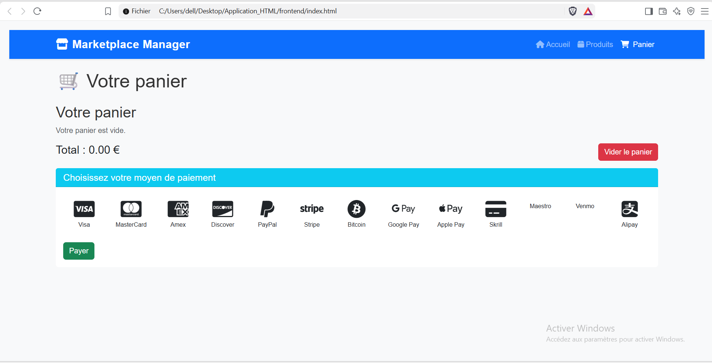
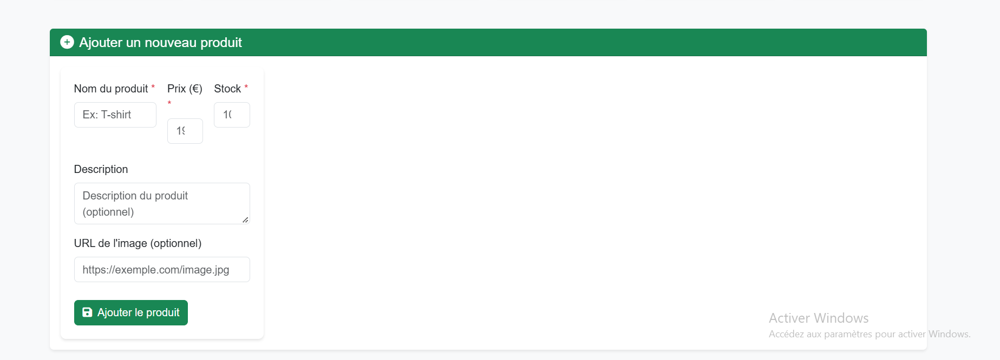

# Application Marketplace E-commerce

Une application web full-stack complète pour la gestion d'une marketplace e-commerce. Ce projet permet aux administrateurs de gérer les produits (CRUD) et aux utilisateurs de naviguer, ajouter au panier et simuler un paiement.

##  Fonctionnalités
- **Gestion des produits (CRUD) :** Ajout, modification, suppression et affichage des produits.
- **Affichage dynamique :** Mise en avant des 6 produits les plus récents sur la page d'accueil.
- **Panier d'achat :** Ajout avec vérification du stock, persistance via `localStorage`, mise à jour dynamique du badge et du total.
- **Simulation de paiement :** Sélection du moyen de paiement (Visa, MasterCard, PayPal, etc.) et validation de la commande.
- **Interface responsive :** Design moderne et adaptatif grâce à Bootstrap 5 et Font Awesome.
- **Sécurité :** Requêtes SQL préparées (anti-injection), échappement HTML (anti-XSS) et gestion des erreurs.

##  Technologies utilisées
- **Frontend :** HTML5, CSS3, JavaScript (ES6), Bootstrap 5, Font Awesome.
- **Backend :** Node.js, Express.js.
- **Base de données :** MySQL (avec pool de connexions).
- **Outils :** VS Code, Postman, Git.

##  Architecture du projet
L'application repose sur une architecture client-serveur classique avec une séparation claire du backend et du frontend :
- `backend/` : Serveur Express, routes API REST, contrôleurs et configuration de la base de données.
- `frontend/` : Interface utilisateur (HTML, CSS, JS).
- `screens_Marketplace/` : Captures d'écran de l'application.

##  Aperçu de l'application

### Page d'accueil (Produits récents)


### Tous les produits


### Panier et paiement


### Formulaire d'ajout de produit


### Modale d'édition


##  Comment exécuter le projet localement

1. **Cloner le dépôt :**
   ```bash
   git clone https://github.com/mehdi-rizqy/marketplace-ecommerce-nodejs.git
